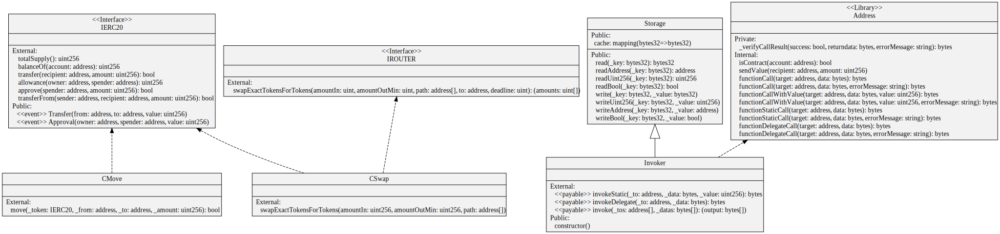

# invoker-contract-evm

[](https://github.com/vektor-finance/invoker-contract-evm/actions/workflows/main.yaml)

Solidity contracts for Vektor's EVM invoker.

## Overview

TODO

## Testing and Development

### Environment Variables

For testing, this project requires you have an API key for (both are free to create):

- [Etherscan](https://etherscan.io/apis)
- [Infura](https://infura.io/)

They must be set in the shell environment before running most `brownie` commands.

Copy the `.env.template` file and set the values:

```bash
cp .env.template .env
edit .env
```

### Dependencies

- [python3](https://www.python.org/downloads/release/python/) - tested with version `3.8.6`.
- [brownie](https://github.com/iamdefinitelyahuman/brownie) - tested with version `1.16.0`.
- [hardhat](https://hardhat.org/) - tested with version `2.6.0`.

### Setup

To get started, first create and initialize a Python [virtual environment](https://docs.python.org/3/library/venv.html). Next, clone the repo and install the developer dependencies:

```bash
git clone https://github.com/vektorfinance/invoker-contract-evm.git
cd invoker-contract-evm
pip install -r requirements.txt
yarn install
```

### Configuring Pre-commit

[Pre-commit](https://pre-commit.com/) is a tool that executes linting checks each time you make a commit. It is useful for enforcing proper codestyle and preventing commits that would fail the linting build.

To install pre-commit locally:

```bash
pre-commit install
```

Once installed, the pre-commit hooks will automatically run each time you make a commit.

You can also run them ad-hoc with:

```bash
pre-commit run --all-files
```

### Running the Tests

To run the entire suite:

```bash
brownie test
```

## Contracts Architecture

### UML Diagram



To generate a new diagram run `yarn uml`.
